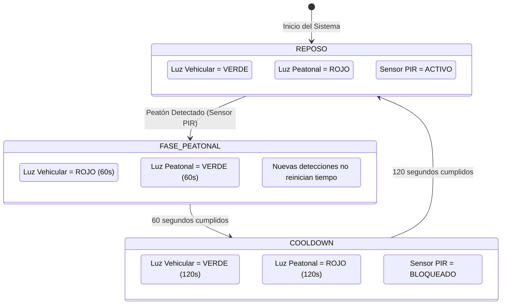

# SemaforoIA - Control Peatonal Inteligente con Sensores IoT

[](https://github.com/EnzoAyala/semaforo-ai/actions/workflows/ci.yml)


## 1. Problema y Solución
En muchas avenidas, los semáforos peatonales cambian a rojo para los vehículos de forma periódica, incluso cuando no hay peatones esperando. Esto genera congestión vehicular innecesaria y pérdida de tiempo.

Nuestra solución utiliza **sensores de movimiento (PIR / Arduino)** para detectar cuando hay personas esperando cruzar. Al detectarlas:
1. El semáforo cambia a **rojo para los vehículos** (permitiendo el paso libre a peatones) durante **1 minuto (60 segundos)**.
2. Una vez concluido el minuto, el sistema entra en un **tiempo de enfriamiento (*cooldown*) de 2 minutos (120 segundos)** donde la vía vehicular permanece en verde y el sensor no se reactiva, garantizando la fluidez y evitando bloqueos continuos.
3. Terminado el *cooldown*, el sistema vuelve a modo **REPOSO**, listo para atender la siguiente solicitud peatonal.

---

## 2. Diagrama de Estados de la Lógica



---

## 3. Arquitectura del Proyecto y Estructura

```
semaforo-ai/
│
├── .github/
│   └── workflows/
│       └── ci.yml               # Pipeline CI/CD automatizado (GitHub Actions)
│
├── src/
│   ├── logic.py                 # Lógica de estados, temporización e inyección de tiempo
│   └── app.py                   # Script ejecutable de simulación en consola
│
├── test/
│   └── test_logic.py            # Batería completa de pruebas unitarias con Pytest
│
├── Dockerfile                   # Contenedorización con Python 3.11-slim
├── requirements.txt             # Dependencias del proyecto (pytest, bandit)
└── README.md                    # Documentación técnica y evidencias
```

---

## 4. Ejecución del Proyecto y Pruebas

### 🔹 Ejecutar Simulación en Consola
```powershell
.\scripts\run.ps1 app
```

### 🔹 Ejecutar Pruebas Unitarias Automatizadas
```powershell
.\scripts\run.ps1 test -- -v
```

Los comandos anteriores almacenan el bytecode de Python en `.cache/python/` y la caché de pytest en `.cache/pytest/`, por lo que no se crean carpetas `__pycache__` en `src/` ni `tests/`.

Si Windows bloquea la ejecución de scripts, usa `powershell -ExecutionPolicy Bypass -File .\scripts\run.ps1 app` o `powershell -ExecutionPolicy Bypass -File .\scripts\run.ps1 test -v`. Esta opción solo se aplica a esa ejecución y no modifica la política del sistema.

### 🔹 Ejecutar Análisis de Seguridad de Código
```bash
bandit -r src
```

### 🔹 Construir y Ejecutar con Docker
```bash
docker build -t semaforo-ia:latest .
docker run --rm semaforo-ia:latest
```

---

## 5. Evidencias de Validación y Pipeline CI/CD

### ✅ Pruebas Unitarias (`pytest`)
Todas las pruebas unitarias pasan al 100% de forma determinista y en milisegundos gracias a la inyección de tiempo:

```text
============================= test session starts =============================
collected 10 items

test/test_logic.py::test_estado_inicial PASSED                           [ 10%]
test/test_logic.py::test_deteccion_peaton_activa_luz_roja PASSED         [ 20%]
test/test_logic.py::test_deteccion_repetida_durante_fase_peatonal_no_reinicia_tiempo PASSED [ 30%]
test/test_logic.py::test_transicion_de_fase_peatonal_a_cooldown PASSED   [ 40%]
test/test_logic.py::test_deteccion_durante_cooldown_es_rechazada PASSED  [ 50%]
test/test_logic.py::test_transicion_de_cooldown_a_reposo PASSED          [ 60%]
test/test_logic.py::test_nueva_deteccion_exitosa_post_cooldown PASSED    [ 70%]
test/test_logic.py::test_condiciones_de_borde_temporales PASSED          [ 80%]
test/test_logic.py::test_configuracion_tiempos_personalizados PASSED     [ 90%]
test/test_logic.py::test_controlar_semaforo_evento_helper PASSED         [100%]

============================= 10 passed in 0.30s ==============================
```

### 🛡️ Análisis Estático de Seguridad (`bandit`)
```text
Test results:
	No issues identified.
Code scanned:
	Total lines of code: 184
	Total potential issues: 0
```

---

## 6. Integrantes del Equipo
* **Enzo Ayala:** Arquitectura, Estructura de Proyecto y Docker.
* **Victor Chavez:** Lógica del Semáforo y Pruebas Unitarias.
* **Brillight Chunga:** Pipeline CI/CD, Seguridad y Gestión de Commits.