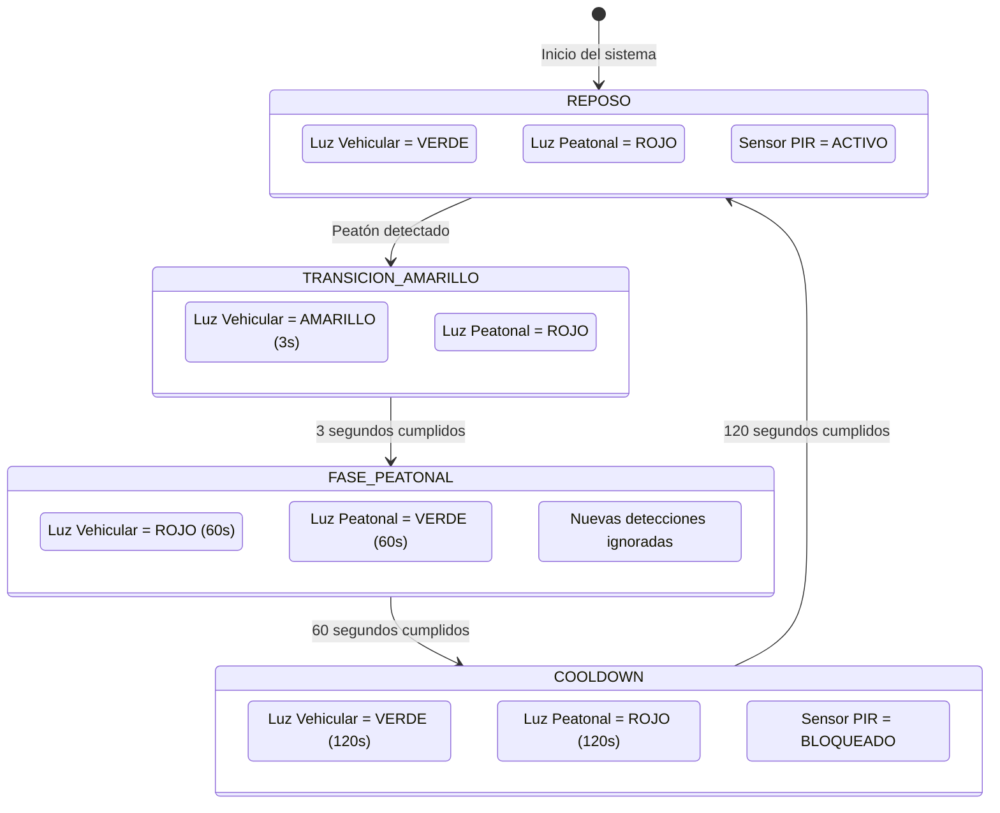

# 🚦 SemaforoIA - Control Peatonal Inteligente con Sensores IoT

Sistema inteligente de control peatonal que utiliza sensores IoT para detectar la presencia de peatones y gestionar automáticamente los estados de un semáforo. El proyecto integra un **backend desarrollado en Python/FastAPI**, un **dashboard web desarrollado con React + Vite**, pruebas automatizadas, análisis de seguridad, Docker y un pipeline de CI/CD.

## 1. Problema y Solución

En avenidas con alta circulación vehicular, los semáforos peatonales pueden realizar cambios de señal de manera periódica incluso cuando no existen peatones esperando para cruzar. Esto puede generar **detenciones innecesarias, congestión vehicular y pérdida de tiempo**.

### 💡 Solución propuesta

**SemaforoIA** utiliza sensores de movimiento **PIR / Arduino** para detectar la presencia de peatones y activar el ciclo de cruce únicamente cuando sea necesario.

El funcionamiento principal es:

1. **Detección del peatón**

   * El sistema permanece en estado **REPOSO**.
   * El sensor PIR se encuentra activo.
   * Cuando detecta un peatón, se inicia el ciclo de cruce.

2. **Transición de advertencia**

   * La luz vehicular cambia a **AMARILLO durante 3 segundos**.
   * La luz peatonal permanece en ROJO durante esta etapa.
   * Esta fase advierte a los vehículos antes de detener el tránsito.

3. **Fase peatonal**

   * La luz vehicular cambia a **ROJO durante 60 segundos**.
   * La luz peatonal cambia a **VERDE durante 60 segundos**.
   * Los peatones pueden realizar el cruce de forma segura.
   * Nuevas detecciones del sensor no reinician el temporizador.

4. **Tiempo de enfriamiento (Cooldown)**

   * Finalizada la fase peatonal, el sistema entra en **COOLDOWN durante 120 segundos**.
   * La luz vehicular permanece en VERDE.
   * La luz peatonal permanece en ROJO.
   * El sensor PIR permanece bloqueado para evitar activaciones continuas.

5. **Retorno al estado inicial**

   * Después de los 120 segundos, el sistema vuelve a **REPOSO**.
   * El sensor vuelve a estar disponible para detectar un nuevo peatón.

6. **Notificaciones**

   * El sistema incorpora un módulo de automatización mediante **SMTP**.
   * Permite enviar notificaciones por correo electrónico relacionadas con eventos o reportes del sistema.

---

## 2. 🔄 Diagrama de Estados de la Lógica



---

## 3. 🏗️ Arquitectura del Proyecto

El proyecto utiliza una arquitectura dividida en **Frontend, Backend y componentes de automatización**, permitiendo separar la interfaz visual de la lógica principal del sistema.

```text
semaforo-ai/
│
├── .github/
│   └── workflows/
│       └── ci.yml
│           # Pipeline CI/CD con GitHub Actions
│
├── frontend/
│   ├── src/
│   │   ├── components/
│   │   │   # Componentes visuales reutilizables
│   │   │
│   │   ├── hooks/
│   │   │   # Custom Hook useSemaforo.js
│   │   │
│   │   ├── services/
│   │   │   # Cliente HTTP para comunicación con la API
│   │   │
│   │   ├── App.jsx
│   │   │   # Aplicación principal
│   │   │
│   │   └── App.css
│   │       # Estilos del dashboard
│   │
│   └── package.json
│       # Dependencias del Frontend
│
├── src/
│   ├── api.py
│   │   # API REST desarrollada con FastAPI
│   │
│   ├── automation.py
│   │   # Automatización de correos mediante SMTP
│   │
│   ├── logic.py
│   │   # Máquina de estados finitos del semáforo
│   │
│   └── app.py
│       # Simulación interactiva del sistema
│
├── tests/
│   ├── test_logic.py
│   │   # Pruebas unitarias de la lógica FSM
│   │
│   └── test_automation.py
│       # Pruebas del módulo de automatización
│
├── Dockerfile
│   # Configuración para ejecutar la aplicación en Docker
│
├── requirements.txt
│   # Dependencias del Backend
│
└── README.md
    # Documentación del proyecto
```

---

## 4. 🧩 Tecnologías Utilizadas

| Tecnología         | Uso                                         |
| ------------------ | ------------------------------------------- |
| **Python 3.11**    | Desarrollo del Backend y lógica del sistema |
| **FastAPI**        | Creación de la API REST                     |
| **React 18**       | Desarrollo de la interfaz web               |
| **Vite**           | Herramienta de desarrollo del Frontend      |
| **Pytest**         | Pruebas unitarias                           |
| **Bandit**         | Análisis estático de seguridad              |
| **Docker**         | Contenerización de la aplicación            |
| **GitHub Actions** | Automatización del pipeline CI/CD           |
| **SMTP**           | Envío de notificaciones por correo          |
| **PIR / Arduino**  | Detección de movimiento                     |

---

## 5. ▶️ Guía de Ejecución Local

### 🐍 5.1 Backend

Instalar las dependencias:

```bash
pip install -r requirements.txt
```

Iniciar la API:

```bash
uvicorn src.api:app --reload --port 8000
```

La API estará disponible en:

```text
http://localhost:8000
```

---

### ⚛️ 5.2 Frontend

Ingresar a la carpeta del Frontend:

```bash
cd frontend
```

Instalar las dependencias:

```bash
npm install
```

Ejecutar el servidor de desarrollo:

```bash
npm run dev
```

El dashboard estará disponible normalmente en:

```text
http://localhost:5173
```

---

## 6. 🧪 Pruebas y Validación

### 🔹 6.1 Pruebas Unitarias

Las pruebas permiten verificar el correcto funcionamiento de la máquina de estados y sus diferentes transiciones.

```powershell
.\scripts\run.ps1 test -- -v
```

Resultado esperado:

```text
10 passed
```

Las principales validaciones incluyen:

* Estado inicial del sistema.
* Detección de peatones.
* Activación de la luz amarilla.
* Activación de la fase peatonal.
* Control de los 60 segundos.
* Rechazo de nuevas detecciones durante la fase peatonal.
* Activación del cooldown.
* Bloqueo del sensor durante el cooldown.
* Retorno al estado REPOSO.
* Configuración de tiempos personalizados.

---

### 🛡️ 6.2 Análisis de Seguridad

Se utiliza **Bandit** para detectar posibles problemas de seguridad en el código Python.

```bash
bandit -r src
```

Resultado actual:

```text
No issues identified.

Total lines of code: 184
Total potential issues: 0
```

---

### 🐳 6.3 Docker

Construir la imagen:

```bash
docker build -t semaforo-ia:latest .
```

Ejecutar el contenedor:

```bash
docker run --rm -p 8000:8000 semaforo-ia:latest
```

---

## 7. 🔄 Pipeline CI/CD

El proyecto utiliza **GitHub Actions** para automatizar la validación del código.

El pipeline permite realizar comprobaciones como:

```text
┌──────────────────────┐
│    Push / Commit     │
└──────────┬───────────┘
           ↓
┌──────────────────────┐
│ Instalación de       │
│ dependencias         │
└──────────┬───────────┘
           ↓
┌──────────────────────┐
│ Pruebas unitarias    │
│ con Pytest           │
└──────────┬───────────┘
           ↓
┌──────────────────────┐
│ Análisis de seguridad│
│ con Bandit           │
└──────────┬───────────┘
           ↓
┌──────────────────────┐
│ Construcción Docker  │
└──────────┬───────────┘
           ↓
┌──────────────────────┐
│      BUILD OK        │
└──────────────────────┘
```

### Estado de validación

* ✅ **10 pruebas unitarias aprobadas**
* ✅ **Bandit: 0 problemas detectados**
* ✅ **Construcción Docker**
* ✅ **Pipeline CI/CD automatizado**

---

## 8. 📧 Automatización de Correos

El módulo `automation.py` permite integrar el sistema con un servidor SMTP para enviar notificaciones mediante correo electrónico.

```text
Evento del sistema
       ↓
Módulo automation.py
       ↓
Servidor SMTP
       ↓
Correo electrónico
       ↓
Usuario / Administrador
```

Esta funcionalidad permite complementar el monitoreo del sistema con notificaciones automáticas ante eventos definidos por la aplicación.

---

## 9. 👥 Integrantes del Equipo

### 👨‍💻 Enzo Ayala

* Arquitectura Backend.
* API REST con FastAPI.
* Docker.
* Integración general del Backend.
* Módulo de automatización de correos mediante SMTP.

### 👨‍💻 Victor Chavez

* Lógica FSM del semáforo.
* Temporización de estados.
* Integración de la lógica inteligente.
* Pruebas unitarias.

### 👩‍💻 Brillight Chunga

* Desarrollo del Frontend con React + Vite.
* Diseño de la interfaz y dashboard.
* Integración Frontend ↔ API.
* Pipeline CI/CD.
* Gestión de seguridad y validación del proyecto.

---

## 10. 📌 Estado Actual del Proyecto

| Componente           | Estado                  |
| -------------------- | ----------------------- |
| Lógica FSM           | ✅ Implementado          |
| Sensor PIR / Arduino | ✅ Integración planteada |
| API REST             | ✅ Implementado          |
| Dashboard Web        | ✅ Implementado          |
| Automatización SMTP  | ✅ Implementado          |
| Pruebas unitarias    | ✅ 10 pruebas aprobadas  |
| Seguridad Bandit     | ✅ 0 problemas           |
| Docker               | ✅ Implementado          |
| CI/CD                | ✅ Implementado          |

---

## 🚦 Conclusión

**SemaforoIA** integra IoT, desarrollo Backend, desarrollo Frontend, automatización, pruebas y DevOps en una solución orientada a mejorar la gestión del cruce peatonal.

El sistema busca que la activación del cruce peatonal se realice **cuando exista una solicitud real**, manteniendo mecanismos de temporización y enfriamiento para evitar activaciones continuas y favorecer la fluidez vehicular.
